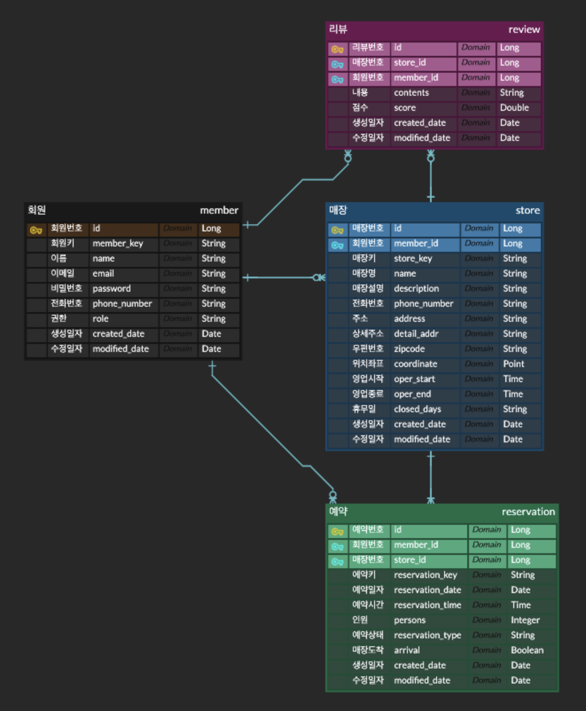

# 매장 예약 서비스 API
## 기능 요구 사항
1. 회원가입
    - 유저/매니저별 회원가입을 할 수 있습니다.
2. 매장 검색
    - 로그인한 사용자는 매장을 검색할 수 있습니다.
    - 매장명 검색 시 자동완성 기능을 제공합니다.
    - 내 위치 기반 반경 3km 이내의 매장을 조회할 수 있습니다.
    - 매니저는 매장을 등록, 수정, 삭제할 수 있습니다. 
3. 매장 예약
    - 로그인한 사용자는 매장을 예약할 수 있습니다.
    - 매니저는 예약을 확인한 후 승인/취소 할 수 있습니다.
    - 매장을 예약한 사용자는 예약 시간 10분 전에 매장에 도착하여 도착 확인을 진행합니다.
4. 매장 이용 리뷰
    - 매장 이용을 완료한 회원은 해당 매장에 대한 리뷰를 작성, 수정, 삭제할 수 있습니다.
    - 매니저는 본인의 매장에 대한 리뷰를 삭제할 수 있습니다.

## 개발 환경
- Java 17
- Spring boot 3.1.5
- Spring security 3.1.5
- Gradle 8.4
- Spring data JPA
- Querydsl
- MySQL

## 외부 라이브러리 목록
| Dependency           | Version | Purpose                              |
|----------------------|---------|--------------------------------------|
| io.jsonwebtoken:jjwt | 0.12.3  | JWT 발행을 위한 기능을 제공하는 라이브러리           |
|org.apache.httpcomponents.client5| 5.2.1   | HTTP 클라이언트 기능을 제공하는 라이브러리            |
|com.querydsl:querydsl| 5.0.0   | SQL 등의 쿼리를 타입에 안전하게 생성 및 관리해주는 프레임워크 |
|org.hibernate:hibernate-spatial| 6.2.13  | 지리 데이터에 대한 표준 인터페이스를 제공하는 라이브러리      |

## 프로젝트 구조
```
src
├── main
│   ├── java
│   │   └── com
│   │       └── zerobase
│   │           └── reserve
│   │               ├── ReserveApplication.java
│   │               ├── domain
│   │               │   ├── common
│   │               │   │   ├── entity
│   │               │   │   │   └── BaseTimeEntity.java
│   │               │   │   ├── utils
│   │               │   │   │   └── KeyGenerator.java
│   │               │   │   └── validator
│   │               │   │       ├── EnumValidator.java
│   │               │   │       └── ValidEnum.java
│   │               │   ├── member
│   │               │   │   ├── api
│   │               │   │   │   └── AuthController.java
│   │               │   │   ├── converter
│   │               │   │   │   └── RoleConverter.java
│   │               │   │   ├── dto
│   │               │   │   │   ├── Signin.java
│   │               │   │   │   ├── Signup.java
│   │               │   │   │   └── model
│   │               │   │   │       └── MemberDto.java
│   │               │   │   ├── entity
│   │               │   │   │   ├── Member.java
│   │               │   │   │   └── Role.java
│   │               │   │   ├── exception
│   │               │   │   │   └── MemberException.java
│   │               │   │   ├── repository
│   │               │   │   │   └── MemberRepository.java
│   │               │   │   └── service
│   │               │   │       ├── AuthService.java
│   │               │   │       ├── CustomUserDetailsService.java
│   │               │   │       └── MemberService.java
│   │               │   ├── reservation
│   │               │   │   ├── api
│   │               │   │   │   └── ReservationController.java
│   │               │   │   ├── converter
│   │               │   │   │   ├── LocalTimeConverter.java
│   │               │   │   │   └── ReservationTypeConverter.java
│   │               │   │   ├── dto
│   │               │   │   │   ├── Confirm.java
│   │               │   │   │   ├── ReservationsResponse.java
│   │               │   │   │   ├── Reserve.java
│   │               │   │   │   ├── Visit.java
│   │               │   │   │   └── model
│   │               │   │   │       └── ReservationDto.java
│   │               │   │   ├── entity
│   │               │   │   │   └── Reservation.java
│   │               │   │   ├── exception
│   │               │   │   │   └── ReservationException.java
│   │               │   │   ├── repository
│   │               │   │   │   ├── CustomReservationRepository.java
│   │               │   │   │   ├── ReservationRepository.java
│   │               │   │   │   └── impl
│   │               │   │   │       └── CustomReservationRepositoryImpl.java
│   │               │   │   ├── service
│   │               │   │   │   └── ReservationService.java
│   │               │   │   └── type
│   │               │   │       └── ReservationType.java
│   │               │   ├── review
│   │               │   │   ├── api
│   │               │   │   │   └── ReviewController.java
│   │               │   │   ├── dto
│   │               │   │   │   ├── DeleteResponse.java
│   │               │   │   │   ├── Update.java
│   │               │   │   │   ├── Write.java
│   │               │   │   │   └── model
│   │               │   │   │       └── ReviewDto.java
│   │               │   │   ├── entity
│   │               │   │   │   └── Review.java
│   │               │   │   ├── exception
│   │               │   │   │   └── ReviewException.java
│   │               │   │   ├── repository
│   │               │   │   │   ├── CustomReviewRepository.java
│   │               │   │   │   ├── ReviewRepository.java
│   │               │   │   │   └── impl
│   │               │   │   │       └── CustomReviewRepositoryImpl.java
│   │               │   │   └── service
│   │               │   │       └── ReviewService.java
│   │               │   └── store
│   │               │       ├── api
│   │               │       │   └── StoreController.java
│   │               │       ├── converter
│   │               │       │   └── ListConverter.java
│   │               │       ├── dto
│   │               │       │   ├── DeleteResponse.java
│   │               │       │   ├── EditRequest.java
│   │               │       │   ├── Location.java
│   │               │       │   ├── Registration.java
│   │               │       │   ├── SearchResponse.java
│   │               │       │   ├── StoresResponse.java
│   │               │       │   └── model
│   │               │       │       ├── AddressDto.java
│   │               │       │       ├── SalesInfoDto.java
│   │               │       │       └── StoreDto.java
│   │               │       ├── entity
│   │               │       │   ├── Address.java
│   │               │       │   ├── SalesInfo.java
│   │               │       │   └── Store.java
│   │               │       ├── exception
│   │               │       │   └── StoreException.java
│   │               │       ├── repository
│   │               │       │   ├── CustomStoreRepository.java
│   │               │       │   ├── StoreRepository.java
│   │               │       │   ├── impl
│   │               │       │   │   └── CustomStoreRepositoryImpl.java
│   │               │       │   └── projection
│   │               │       │       └── StoreProjection.java
│   │               │       ├── service
│   │               │       │   └── StoreService.java
│   │               │       └── type
│   │               │           └── SRID.java
│   │               └── global
│   │                   ├── config
│   │                   │   ├── JpaAuditingConfig.java
│   │                   │   ├── QuerydslConfig.java
│   │                   │   └── SecurityConfig.java
│   │                   ├── exception
│   │                   │   ├── ApiExternalException.java
│   │                   │   ├── CustomException.java
│   │                   │   ├── ErrorCode.java
│   │                   │   ├── ErrorResponse.java
│   │                   │   └── GlobalExceptionHandler.java
│   │                   ├── infra
│   │                   │   └── address
│   │                   │       ├── CoordinateClient.java
│   │                   │       ├── dto
│   │                   │       │   ├── CoordinateDto.java
│   │                   │       │   └── KakaoResponseDto.java
│   │                   │       └── impl
│   │                   │           └── KakaoCoordinateClient.java
│   │                   ├── security
│   │                   │   ├── AuthenticationFilter.java
│   │                   │   ├── CustomAccessDeniedHandler.java
│   │                   │   ├── CustomAuthenticationEntryPoint.java
│   │                   │   └── TokenProvider.java
│   │                   └── utils
│   │                       ├── ObjectMapperUtils.java
│   │                       └── RestTemplateUtils.java
│   └── resources
│       ├── application-key.yml
│       ├── application.yml
│       ├── static
│       └── templates
└── test
    └── java
        └── com
            └── zerobase
                └── reserve
                    ├── domain
                    │   ├── common
                    │   │   ├── builder
                    │   │   │   ├── MemberBuilder.java
                    │   │   │   ├── ReservationBuilder.java
                    │   │   │   ├── ReviewBuilder.java
                    │   │   │   ├── StoreBuilder.java
                    │   │   │   └── dto
                    │   │   │       ├── MemberDtoBuilder.java
                    │   │   │       ├── RegistRequestBuilder.java
                    │   │   │       ├── ReservationDtoBuilder.java
                    │   │   │       ├── ReviewDtoBuilder.java
                    │   │   │       └── StoreDtoBuilder.java
                    │   │   └── constants
                    │   │       ├── MemberConstants.java
                    │   │       ├── ReservationConstants.java
                    │   │       ├── ReviewConstants.java
                    │   │       └── StoreConstants.java
                    │   ├── member
                    │   │   ├── api
                    │   │   │   └── AuthControllerTest.java
                    │   │   └── service
                    │   │       └── AuthServiceTest.java
                    │   ├── reservation
                    │   │   ├── api
                    │   │   │   └── ReservationControllerTest.java
                    │   │   └── service
                    │   │       └── ReservationServiceTest.java
                    │   ├── review
                    │   │   ├── api
                    │   │   │   └── ReviewControllerTest.java
                    │   │   └── service
                    │   │       ├── ReviewServiceSecurityTest.java
                    │   │       └── ReviewServiceTest.java
                    │   └── store
                    │       ├── api
                    │       │   ├── StoreControllerSecurityTest.java
                    │       │   └── StoreControllerTest.java
                    │       └── service
                    │           └── StoreServiceTest.java
                    └── http
                        ├── auth.http
                        ├── http-client.env.json
                        ├── http-client.private.env.json
                        ├── reservation.http
                        ├── review.http
                        └── store.http
```

## ERD

